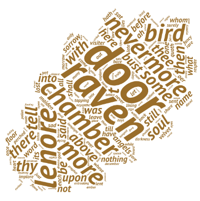

#Word Analyser

###Background
You may want to find the word usage density in a text file, for exmaple to generate a tag cloud. The WordAnalyser class can be used to analyse a source text file and produce an analysis.

###Usage
A WordAnalyser object can be instantiated as
```c++
WordAnalyser();
WordAnalyser(std::string _source_file_name);
WordAnalyser(std::string _source_file_name, std::string _excluded_words_file_name);
```
If the default constructor is used, the source file will then need to be set.

`_excluded_words_file_name` is the path to a text file which contains words to be excluded from the final results. These words are listed on separate lines.

To perform the analysis on the source file, use the `get_freq_count()` method. This returns a `KV_wordmap` variable which can be displayed on the screen using the `pretty_print()` method, or saved to a CSV file using the `save_toCSV()` method.
```c++
typedef std::map<std::string, unsigned int> KV_wordmap;
KV_wordmap WordAnalyser::get_freq_count();
void WordAnalyser::pretty_print(const KV_wordmap & word_map, bool sorted = false);
void WordAnalyser::save_toCSV(const KV_wordmap & word_map, const std::string & output_file_name, const std::string & separator = ";");
```

###Example
As an example, we'll analyse the text to Edgar Allan Poe's peom, [The Raven](http://en.wikipedia.org/wiki/The_Raven), taken from its [Project Gutenberg source](http://www.gutenberg.org/ebooks/17192).

```c++
// file names
std::string source_file = "TheRaven.txt";
std::string exclude_words_file = "excluded_words.txt";
std::string output_filename = "output.csv";

// create a WordAnalyser instant
WordAnalyser wa = WordAnalyser(source_file, exclude_words_file);

// analyse word density in source file
KV_wordmap word_density;
word_density = wa.get_freq_count();

// Output results
std::cout << "Filename: " << wa.filename() << "\n";
// print results to screen
wa.pretty_print(word_density, true);

// save results to file if an output file is given
if (output_filename != "") {
    wa.save_toCSV(word_density, output_filename);
}
```

The output is written to the command line, and is also saved as a CSV file, in the format of `word;frequency`. We'll then use the website [Tagul](https://tagul.com/) to generate a pretty word (tag) cloud for us. Of course, we could have let an online website do the word usage breakdown for us, but that wouldn't have been much fun!



###ToDo
Add further configurations to make the class more versatile.

- Output to other file formats such as JSON,
- Allow to add exclusion words in the code.

